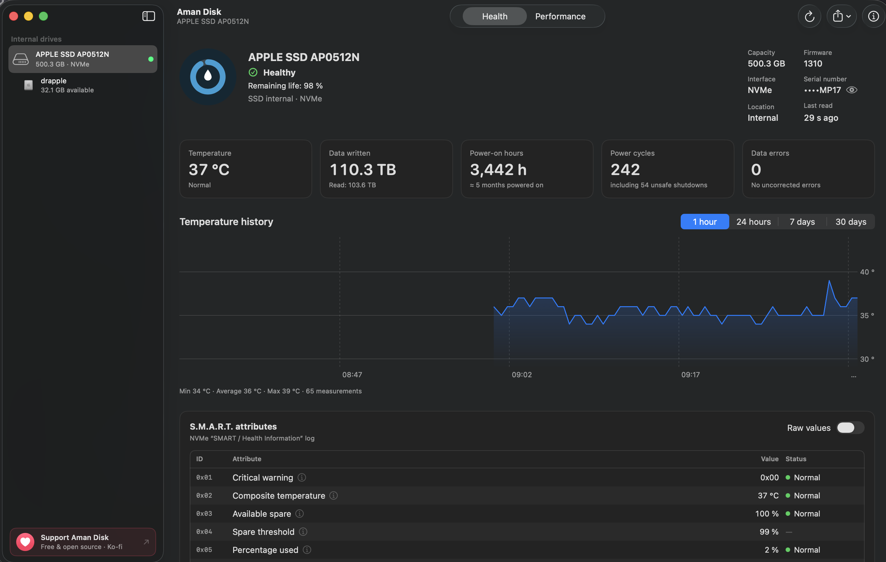
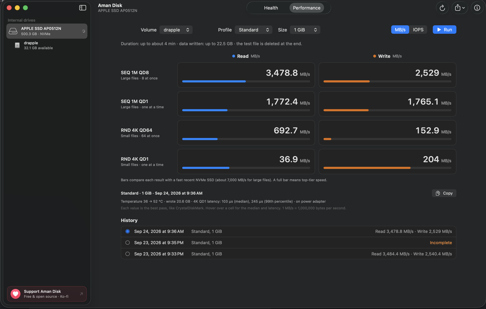
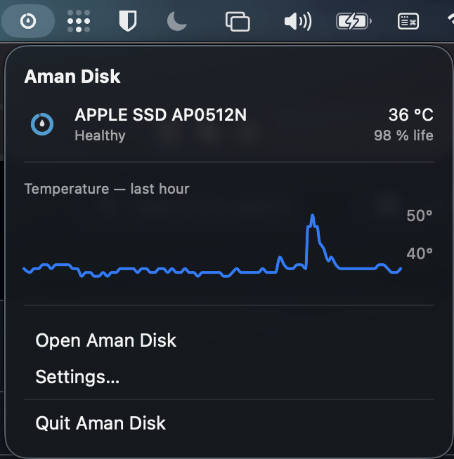

<p align="center">
  <picture>
    <source media="(prefers-color-scheme: dark)" srcset="Branding/Aman-Disk-brand/logo/aman-disk-logo-sombre.svg">
    <source media="(prefers-color-scheme: light)" srcset="Branding/Aman-Disk-brand/logo/aman-disk-logo-clair.svg">
    
  </picture>
</p>

<p align="center"><b>Health, temperature and performance of your Mac's drives, explained in plain language.</b><br>
Internal NVMe and SATA drives today. External USB drives are coming in version 1.0.</p>

<p align="center">
  <a href="https://github.com/MidZai/aman_disk/releases/latest">
    
  </a>
  &nbsp;
  <a href="https://ko-fi.com/midzai">
    
  </a>
</p>

<p align="center">
  <sub>Free and open source · macOS 14 or later · Apple Silicon and Intel · <a href="https://github.com/MidZai/aman_disk/releases/latest">Latest version</a></sub>
</p>

<p align="center">
  
</p>

## Screenshots

| Performance test | Menu bar |
|---|---|
|  |  |

## Features

- **NVMe and ATA/AHCI health**: reads S.M.A.R.T. data from NVMe SSDs, Apple PCIe AHCI SSDs and SATA drives, with a clear status (“Healthy”, “Needs attention”, “Likely failing”) and the remaining life when the drive reports it.
- **Attributes explained**: every S.M.A.R.T. attribute has a readable name and an explanation; values are converted to their unit (°C, hours, TB), or shown as raw hexadecimal on request.
- **Temperature history**: one reading every 30 seconds, kept at full resolution for 24 hours, then as averages for 30 days; charts over 1 hour, 24 hours, 7 days and 30 days. Each reading adds about 170 bytes to the history, so the app doesn't wear out the drive it watches.
- **Performance test**: sequential and random reads and writes. The test file is always deleted.
- **Menu bar**: status and temperature of each internal drive, with the last hour's curve. The app can stay there when its window is closed.
- **Live Dock icon**: the ring around the icon follows the health of the startup drive.
- **Alerts**: a notification when a drive changes status, stays too hot, or drops below 50 %, 25 % or 10 % of its life (off by default).
- **Reports**: PDF, text or JSON export, with the serial number masked by default.
- **English and French** interface.

## Privacy

- **No network connection**: Aman Disk never connects to the Internet. No telemetry, no update check. The only links (GitHub, including “Check for New Versions…”, and Ko-fi) open in your browser when you click them.
- **No data sent**: history and results stay on your Mac, in `~/Library/Application Support/io.github.aman-disk.AmanDisk/`.
- **Aman never changes your data.** One exception: it turns on S.M.A.R.T. if it's turned off (you can disable this in Settings). The app never asks for an administrator password. The performance test, which you start yourself, writes a temporary file that is deleted afterwards, even if the app is force-quit.

## Installation

1. Download `Aman-Disk-0.9.1.dmg` from the [releases page](https://github.com/MidZai/aman_disk/releases/latest).
2. Open the DMG and drag **Aman Disk** into the **Applications** folder.
3. The app isn't notarized by Apple, so macOS blocks it on first launch. Go to **System Settings › Privacy & Security** and click **“Open Anyway”**. You only need to do this once.

### Build from source

```bash
scripts/bundle.sh --release   # Aman Disk.app, universal binary
scripts/make-dmg.sh           # dist/Aman-Disk-0.9.1.dmg
scripts/test.sh               # full test suite (also works without Xcode)
```

Demo mode (`DISKHEALTH_DEMO=1`) shows fictional drives in every state.

## Compatibility

- **macOS 14 Sonoma** or later.
- **Apple Silicon** and **Intel** Macs (universal binary).
- **Internal** NVMe and AHCI/SATA drives, including Fusion Drive.
- External USB drives: coming in version 1.0 (see below).

## Roadmap to 1.0

The main goal of version 1.0 is **external USB drives**: reading the health of SSDs and hard drives in USB enclosures, when the enclosure passes S.M.A.R.T. commands through. To help, [open an issue](https://github.com/MidZai/aman_disk/issues/new/choose) with the model of your USB drive or enclosure: it helps decide which ones to support first.

## Why “Aman”?

The name has three meanings, and all of them fit an app that watches over your drives:

- In **Arabic**, *amān* (أمان) means safety and security, and also peace of mind: the calm of knowing you are protected.
- In **Kabyle**, *aman* means water, hence the drop at the center of the icon. The ring around it is also the letter ⴰ of the Tifinagh alphabet.
- In **Tolkien**'s world, Aman is the Blessed Realm, the land in the far West where the Valar live. It is Gandalf's original home: before coming to Middle-earth, he lived there as Olórin, in the gardens of Lórien in Valinor.

## Support the project

Aman Disk is free and open source. If you find it useful, you can support its development on Ko-fi.

<a href="https://ko-fi.com/midzai"></a>

## License

[MIT](LICENSE) © 2026 MidZai
