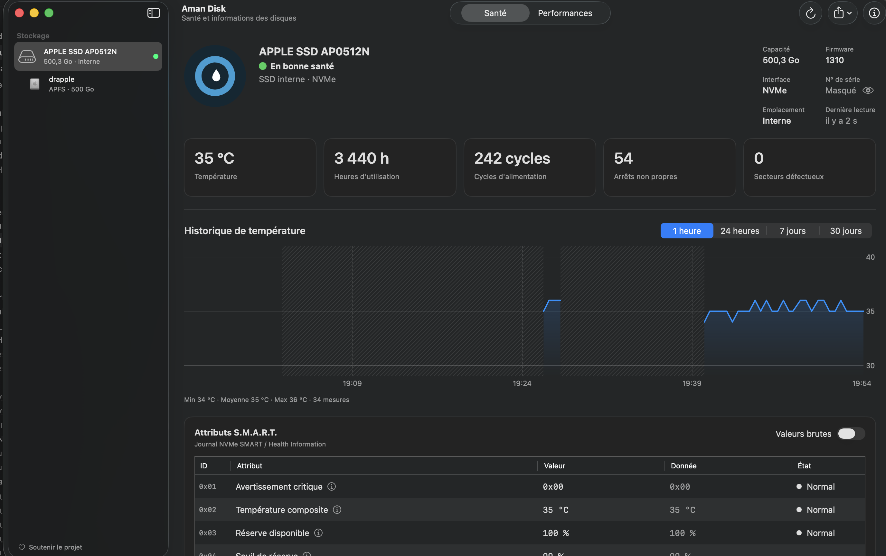

<p align="center">
  <picture>
    <source media="(prefers-color-scheme: dark)" srcset="Branding/Aman-Disk-brand/logo/aman-disk-logo-sombre.svg">
    <source media="(prefers-color-scheme: light)" srcset="Branding/Aman-Disk-brand/logo/aman-disk-logo-clair.svg">
    
  </picture>
</p>

<p align="center">Santé, température et performances des disques internes de votre Mac, expliquées en français.</p>

<p align="center">
  <a href="https://ko-fi.com/midzai"></a>
</p>

> **In English —** Aman Disk is a free, open-source macOS app that shows the health (S.M.A.R.T.), temperature history and performance of your Mac's internal NVMe and SATA/AHCI drives. It lives in the menu bar, turns its Dock icon into a live health gauge, can alert you when a drive changes state, and never connects to the Internet. The interface is in French for now.

## Captures

| Santé du disque | Test de performances | Barre des menus |
|---|---|---|
|  |  |  |

## Fonctions

- **Santé NVMe et ATA/AHCI** : lecture S.M.A.R.T. des SSD NVMe, des SSD Apple PCIe AHCI et des disques SATA, avec un état clair (« En bonne santé », « À surveiller », « Défaillance probable ») et la durée de vie restante quand le disque la fournit.
- **Attributs expliqués en français** : chaque attribut S.M.A.R.T. porte un nom français et une explication ; les valeurs sont converties dans leur unité (°C, heures, To), ou affichées en hexadécimal brut à la demande.
- **Historique de température** : une mesure toutes les 30 secondes, conservée 24 heures en pleine résolution puis 30 jours en moyennes ; courbes sur 1 heure, 24 heures, 7 jours et 30 jours.
- **Test de performances** : lecture et écriture séquentielles et aléatoires ; le fichier de test est toujours supprimé.
- **Barre des menus** : état et température de chaque disque interne, courbe de la dernière heure ; l'app peut y rester quand la fenêtre est fermée.
- **Icône du Dock vivante** : l'anneau de l'icône suit la santé du disque de démarrage.
- **Alertes** : notification quand un disque change d'état, chauffe trop longtemps ou passe sous 50 %, 25 % ou 10 % de durée de vie (désactivées par défaut).
- **Rapports** : export PDF, texte ou JSON, avec numéro de série masqué par défaut.

## Confidentialité

- **Aucune connexion réseau** : Aman Disk ne se connecte jamais à Internet. Pas de télémétrie, pas de vérification de mise à jour. Les seuls liens (GitHub, Ko-fi) s'ouvrent dans votre navigateur, à votre demande.
- **Aucune donnée envoyée** : l'historique et les résultats restent sur votre Mac, dans `~/Library/Application Support/io.github.aman-disk.AmanDisk/`.
- **Lecture seule** : l'app ne modifie jamais un disque ni ses réglages, et ne demande jamais de mot de passe administrateur. Seul le test de performances, lancé par vous, écrit un fichier temporaire, supprimé ensuite.

## Installation

1. Téléchargez `Aman-Disk-0.9.0.dmg` depuis la page des versions (*Releases*).
2. Ouvrez le DMG et glissez **Aman Disk** dans le dossier **Applications**.
3. L'app n'est pas notariée par Apple : au premier lancement, macOS la bloque. Allez dans **Réglages Système › Confidentialité et sécurité** et cliquez sur **« Ouvrir quand même »**. Il suffit de le faire une fois.

### Compiler depuis les sources

```bash
scripts/bundle.sh --release   # Aman Disk.app, binaire universel
scripts/make-dmg.sh           # dist/Aman-Disk-0.9.0.dmg
```

Le mode démo (`DISKHEALTH_DEMO=1`) affiche des disques fictifs dans tous les états.

## Compatibilité

- **macOS 14 Sonoma** ou plus récent.
- Mac **Apple Silicon** et **Intel** (binaire universel).
- Disques **internes** NVMe et AHCI/SATA, y compris Fusion Drive.
- Disques externes et USB : pas encore pris en charge.

## Pourquoi « Aman » ?

*Aman* signifie « eau » en kabyle, d'où la goutte au centre de l'icône. L'anneau qui l'entoure est aussi la lettre ⴰ de l'alphabet tifinagh.

## Soutenir le projet

Aman Disk est gratuit et open source. Si l'app vous est utile, vous pouvez soutenir son développement sur [Ko-fi](https://ko-fi.com/midzai).

## Licence

[MIT](LICENSE) © 2026 Aman Disk contributors.
